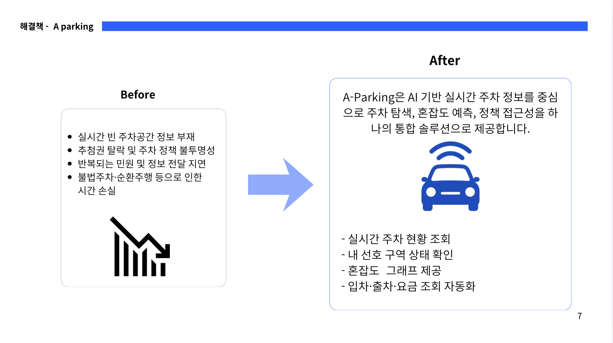
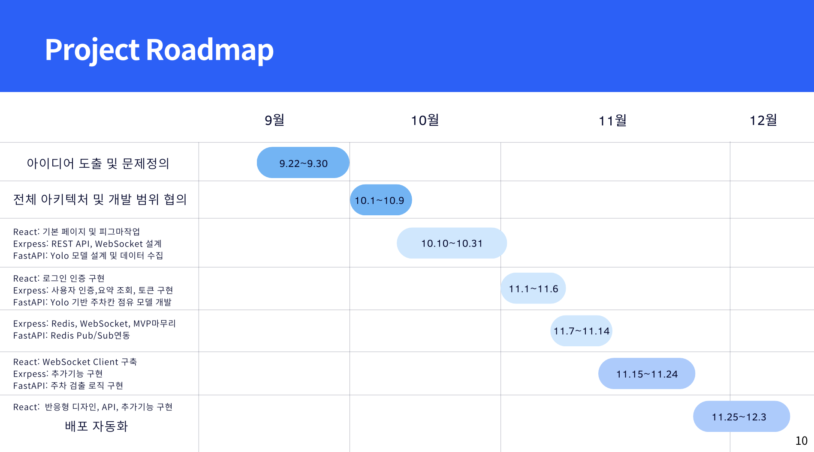
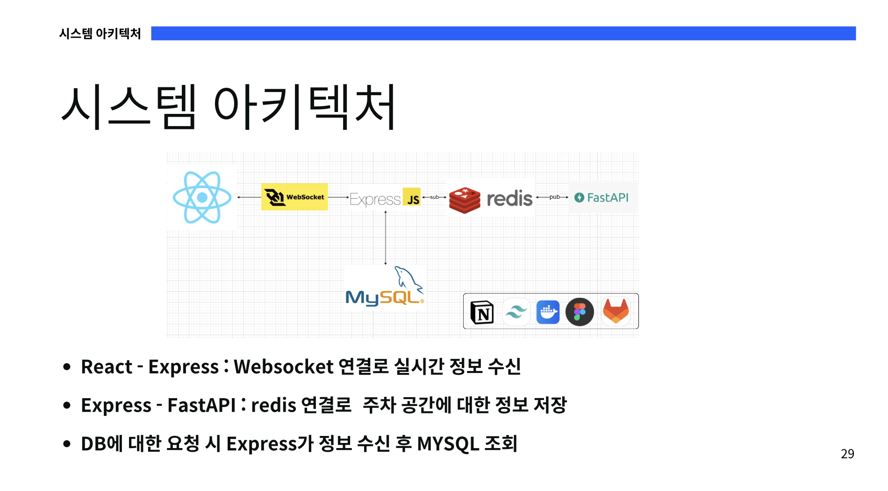
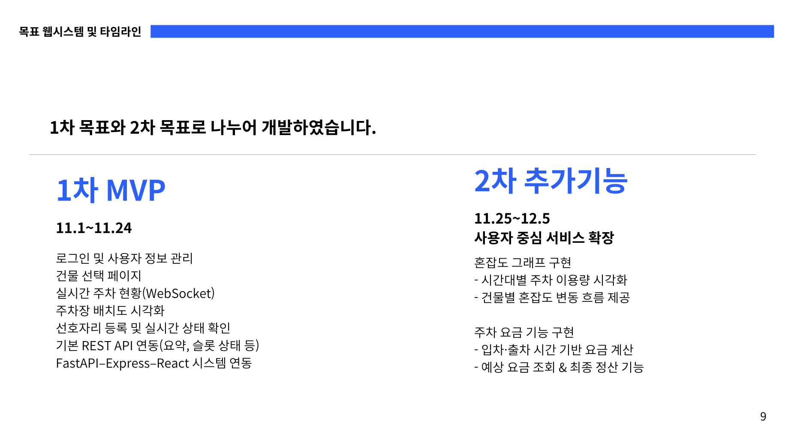
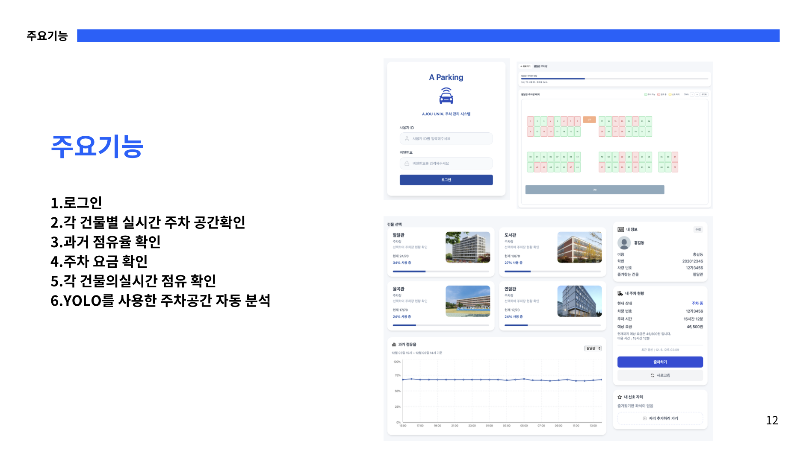
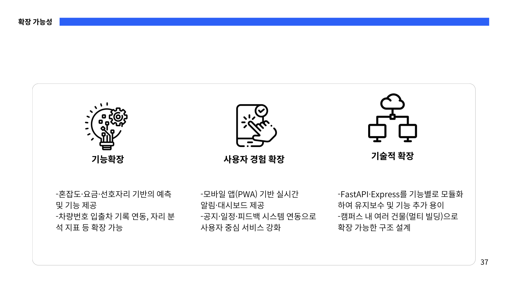
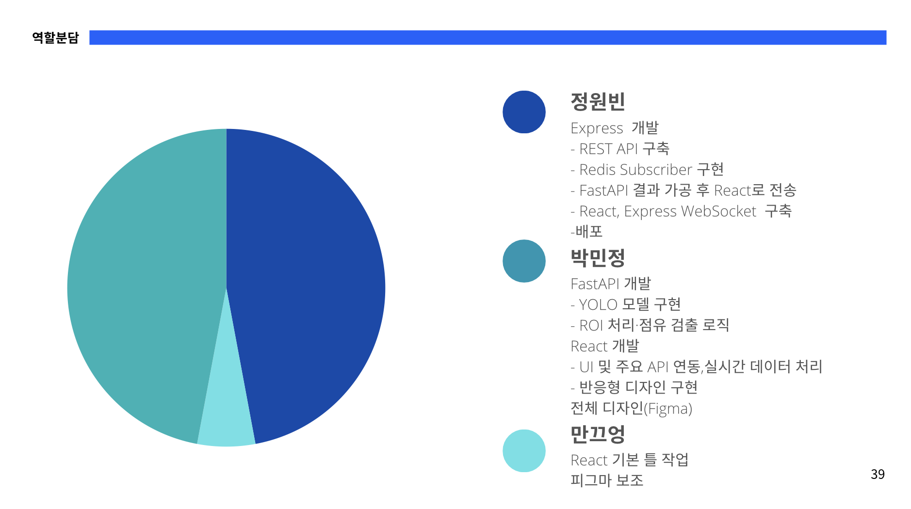

# A-parking 실시간 주차현황 제공시스템

---

### 아주대학교 2025학년도 2학기 웹시스템설계 과목 프로젝트

---

### 프로젝트 개요

A-Parking은 캠퍼스 내 주차 혼잡 문제를 해결하기 위해 개발된 실시간 주차 모니터링 웹 서비스입니다.
학생·교직원이 주차장 이용 시 겪는 불편(빈자리 파악 어려움, 건물별 혼잡도 확인 불가, CCTV 의존 모니터링)을 개선하기 위해, AI 기반 영상 분석과 Web UI 시각화를 결합하여 정확하고 직관적인 주차 정보를 제공합니다.

FastAPI의 차량 검출 모델(YOLO)과 Express 기반의 실시간 데이터 처리, React 기반의 시각화 UI를 통합하여 주차 면 단위 빈자리·점유 상태를 즉시 파악할 수 있는 스마트 캠퍼스 주차 시스템을 목표로 합니다.



---

### 실행방법

Mysql & Redis ( 백그라운드 실행 )

```bash
docker-compose up -d
```

React

```bash
cd react
npm install
npm run dev
```

FastAPI

```bash
 cd python
 pip install -r requirements.txt
 uvicorn app.main:app --reload --port 8000
```

Express

```bash
npm install
cd express
node server.js
```

---

### 개발기간



### 시스템 아키텍처



### 기능





---

### **배포**

Frontend(Vercel) :[**a-parking.vercel.app**](https://a-parking.vercel.app/)

**Backend(EC2) :[a-parking.kro.kr](http://a-parking.kro.kr/)**

데모 id:user, pw: pass

---

### 확장가능성



### 역할분담


